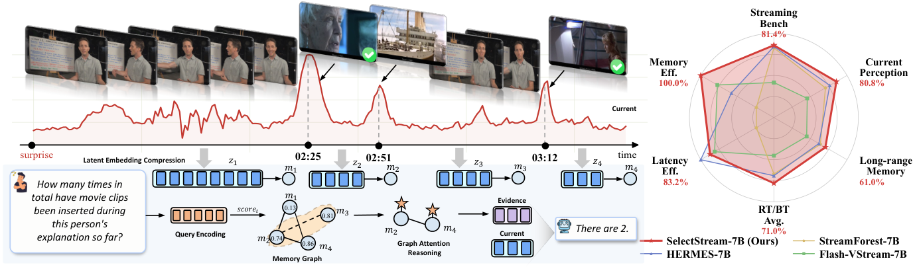
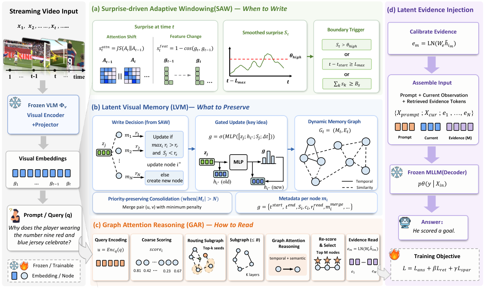
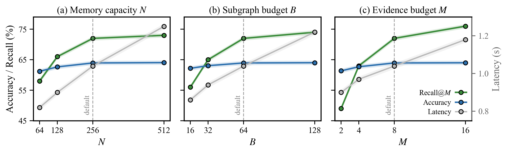
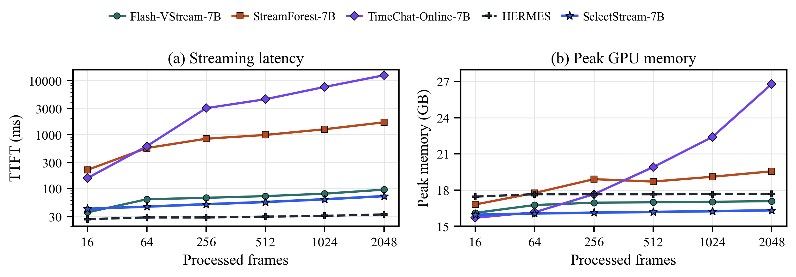

# 【NeurIPS 2026】SelectStream: What Should a Streaming Video Model Remember?

[](https://arxiv.org/abs/2606.16353)
[](https://haonan-ge.github.io/selectstream/)
[](https://huggingface.co/datasets/maifoundations/Streamo-Instruct-465K)
[](#-set-up)

[[📖 Paper](https://arxiv.org/abs/2606.16353)] [[🌐 Project Page](https://haonan-ge.github.io/selectstream/)] [[🤗 Training Data](https://huggingface.co/datasets/maifoundations/Streamo-Instruct-465K)]

**Haonan Ge**<sup>1,2</sup>, **Yiwei Wang**<sup>2</sup>, **Hang Wu**<sup>2</sup>, **Yujun Cai**<sup>3,†</sup>

<sup>1</sup>University of California, Santa Barbara &nbsp; <sup>2</sup>University of California, Merced &nbsp; <sup>3</sup>The University of Queensland &nbsp; <sup>†</sup>Corresponding author

<p align="center">
    
</p>

## 🔥 News

- **[2026/09]** 🎉 SelectStream is accepted to the **NeurIPS 2026** main track!
- **[2026/09]** 🚀 Code, configs and Streamo-Instruct-465K data preparation are released.
- **[2026/06]** 📄 The paper is available on [arXiv](https://arxiv.org/abs/2606.16353).

---

## 👀 About SelectStream

Strong recent-window baselines show that indiscriminately injecting history can **dilute current-scene perception**. The challenge is therefore not *whether* to use memory, but *how to allocate it selectively*.

**SelectStream** formulates streaming memory as **budgeted online latent evidence allocation**. It keeps the current observation directly visible to a frozen VLM, while history is exposed only through a compact, query-conditioned evidence budget. Retrieved evidence is calibrated and injected as latent tokens, without replaying frames or growing the context with stream length.

| | StreamingBench | OVO-Bench | Offline Avg. (VideoMME / MLVU / MVBench) |
| :--- | :---: | :---: | :---: |
| **SelectStream-Qwen3-VL-8B** | **82.67** | **67.03** | **74.4** |

---

## 🎯 Core Task

**Input:**
- A video stream observed causally, frame by frame at 1 fps
- A query arriving at any moment of the stream

**Output:**
- An answer grounded in the current observation plus retrieved historical evidence
- Traceable evidence: every injected token maps to a memory node with a temporal span

**Four decisions under fixed budgets:**
1. **When to write**: Surprise-driven Adaptive Windowing (SAW) closes event-adaptive segments
2. **What to preserve**: Latent Visual Memory (LVM) with gated writing and priority-preserving consolidation keeps at most `N` nodes
3. **How to read**: Graph Attention Reasoning (GAR) routes the query through a subgraph of at most `B` nodes
4. **How much to expose**: only `M` calibrated latent evidence tokens enter the frozen VLM

---

## 🏗️ Architecture

<p align="center">
    
</p>

<p align="left">
    <b>Overview of SelectStream.</b> Projected visual embeddings from the frozen VLM are written into a budgeted latent memory graph. SAW decides when a segment closes, LVM decides what to keep through gated updates and graph-aware consolidation, and GAR retrieves a query-conditioned evidence subgraph. The top-<i>M</i> refined nodes are calibrated into latent evidence tokens and injected after the prompt and current observation.
</p>

---

## 📍 Features

- **Frozen backbones**: Qwen2.5-VL-7B-Instruct and Qwen3-VL-8B-Instruct stay frozen; only lightweight SelectStream modules are trained
- **Projected-embedding memory**: memory is written from the VLM's native projected visual embeddings, so no raw frames are replayed
- **Event-adaptive writing**: segments close on surprise spikes, accumulated surprise energy, or the maximum length
- **Priority-preserving consolidation**: merges redundant nodes while protecting surprising, frequently read, and recently updated evidence
- **Query-conditioned graph reasoning**: seed scoring, budgeted temporal/semantic routing, and relational graph attention
- **Bounded cost**: query latency and GPU memory stay nearly flat as the stream grows, controlled by `N`, `B`, and `M`
- **Grounding metrics**: `Recall@M` and `T-Overlap` of the injected evidence on timestamped data

---

## 📂 Project Structure

```
SelectStream/
├── assets/                           # README figures
├── configs/
│   ├── selectstream_qwen25vl7b_lvm_sft.yaml   # SelectStream + Qwen2.5-VL-7B
│   └── selectstream_qwen3vl8b_lvm_sft.yaml    # SelectStream + Qwen3-VL-8B
├── main/
│   ├── cli/
│   │   ├── train_method_sft.py       # training
│   │   ├── infer_video.py            # streaming inference on one video
│   │   └── eval.py                   # causal streaming evaluation
│   ├── data/
│   │   ├── prepare_streamo.py        # Streamo-Instruct-465K -> SelectStream JSONL
│   │   └── jsonl_dataset.py
│   ├── model/
│   │   ├── lvm_memory.py             # SAW, LVM writing, priority-preserving consolidation
│   │   ├── dmg_gar.py                # subgraph routing, GAR, evidence calibration
│   │   ├── query_builder.py          # query encoder
│   │   └── model.py                  # projected embeddings, evidence injection, decoding
│   ├── trainer/
│   │   └── method_sft.py             # L_ans + β L_ret + γ L_spar, grounding metrics
│   └── utils/
│       └── streaming.py              # causal streaming loop
├── scripts/                          # example launch scripts
└── requirements.txt
```

> [!NOTE]
> `main/cli/train_stage1.py`, `main/cli/train_stage2.py`, the `*_baseline.yaml` / `vismem_*` configs and the `stage*` scripts are legacy compatibility paths and are not part of SelectStream.

---

## 🔍 Dataset

### Training Data: Streamo-Instruct-465K

SelectStream is trained on [Streamo-Instruct-465K](https://huggingface.co/datasets/maifoundations/Streamo-Instruct-465K) from [Streamo](https://github.com/maifoundations/Streamo). Timestamped responses supervise retrieval through temporal overlap with memory-node spans; the rest use the answer loss only.

| Task | Sources |
| :--- | :--- |
| `qa` | ActivityNet, Ego-TimeQA, Koala, LLaVA-Video, QVHighlights, YouCook2, HowTo |
| `event_grounding` | ActivityNet, DiDeMo, Koala, LLaVA-Video, QuerYD, QVHighlights, TACoS |
| `event_caption` | ActivityNet, Koala, LLaVA-Video, QVHighlights |
| `action_caption` | COIN, YouCook2, HowTo |
| `narration` | ActivityNet, Koala, QVHighlights |

#### Step 1: Download annotations

Accept the dataset terms on Hugging Face, then:

```bash
huggingface-cli login
huggingface-cli download maifoundations/Streamo-Instruct-465K --repo-type dataset --local-dir data/Streamo-Instruct-465K
```

#### Step 2: Prepare videos

Videos are not redistributed. Download them from the source datasets above and place them under one root so that `<video_root>/<video_path>` resolves for each annotation:

```
data/
├── Streamo-Instruct-465K/            # annotations: qa/, event_grounding/, ...
└── videos/                           # <video_root>, mirroring each `video_path`
    ├── LLaVA_Video/...
    ├── ActivityNet/...
    └── ...
```

#### Step 3: Convert to SelectStream format

```bash
python -m main.data.prepare_streamo \
  --anno_dir data/Streamo-Instruct-465K \
  --video_root data/videos \
  --output data/streamo_selectstream.jsonl \
  --skip_missing_videos
```

Each Streamo response becomes one causal training row, following Streamo's time convention (time `t` denotes the second `<t-1 s, t s>`):
- **Span responses** (`st_time` / `end_time`): the event frames become `evidence_timestamps` for `L_ret`, and the question is answered at the frame right after the event ends, so the evidence lies in the observed history.
- **Instant responses** (`time`): answered at that frame with the answer loss only.

Use `--tasks qa event_grounding ...` to keep a subset, or `--max_history_sec` to cap the streamed prefix.

### Data Format

Any streaming video QA data can be used in the same JSONL format:

```json
{
  "id": "vid_001_q3",
  "video": "videos/demo.mp4",
  "question": "What happened before this moment?",
  "question_time": 18.5,
  "answer": "He opened the door and entered the room.",
  "evidence_timestamps": [[11.2, 13.0], [14.8, 17.3]],
  "sample_fps": 1.0,
  "stream_update_unit": "frame",
  "start_time": 0.0
}
```

- `video`, `question` (or `prompt`), `question_time`, and `answer` are required.
- `evidence_timestamps` (or node ids in `evidence_ids`) enable `L_ret`; rows without them use the answer loss only.
- Prompts are wrapped in the backbone chat template automatically; only the prefix up to `question_time` is observed.

### Evaluation Benchmarks

| Setting | Benchmarks |
| :--- | :--- |
| Online streaming | StreamingBench, OVO-Bench (Real-Time Visual Perception, Backward Tracing, Forward Active Responding) |
| Offline generalization (causal final-query protocol) | VideoMME, MLVU, MVBench |

---

## 📐 Set up

```bash
git clone https://github.com/Haonan-Ge/selectstream.git
cd selectstream

conda create -n selectstream python=3.10 -y
conda activate selectstream
python -m pip install --upgrade pip setuptools wheel
pip install "numpy<2"
pip install -r requirements.txt
pip install opencv-python-headless   # video decoding fallback
```

`transformers>=4.57` is required for Qwen3-VL.

---

## 🚀 Training

SelectStream uses one-stage supervised fine-tuning with a frozen backbone:

```math
\mathcal{L} = \mathcal{L}_{\text{ans}} + \beta\,\mathcal{L}_{\text{ret}} + \gamma\,\mathcal{L}_{\text{spar}}
```

```bash
# Qwen2.5-VL-7B
python -m main.cli.train_method_sft \
  --config configs/selectstream_qwen25vl7b_lvm_sft.yaml \
  --train_jsonl data/streamo_selectstream.jsonl \
  --output_dir outputs/selectstream_qwen25vl7b \
  --epochs 1

# Qwen3-VL-8B
python -m main.cli.train_method_sft \
  --config configs/selectstream_qwen3vl8b_lvm_sft.yaml \
  --train_jsonl data/streamo_selectstream.jsonl \
  --output_dir outputs/selectstream_qwen3vl8b \
  --epochs 1
```

Training uses AdamW with learning rate `2e-4`, batch size 1, gradient accumulation 4, and bfloat16 (see `training:` in each config).

---

## 🔮 Inference & Evaluation

### Streaming inference on a video

```bash
python -m main.cli.infer_video \
  --config configs/selectstream_qwen25vl7b_lvm_sft.yaml \
  --ckpt outputs/selectstream_qwen25vl7b/epoch0 \
  --video /path/to/video.mp4 \
  --prompt "What happened before this moment?" \
  --show_evidence
```

The answer is generated at the last sampled frame; use `--end_time` or `--query_frame_index` to query earlier moments. `--show_evidence` prints the retrieved nodes, their temporal spans and scores.

### Evaluation

```bash
python -m main.cli.eval \
  --config configs/selectstream_qwen25vl7b_lvm_sft.yaml \
  --jsonl /path/to/eval.jsonl \
  --ckpt outputs/selectstream_qwen25vl7b/epoch0 \
  --method_infer \
  --report_evidence \
  --metric substr
```

Video rows follow the causal streaming protocol: frames are written online and the query is answered on the current frame plus retrieved evidence. With `--report_evidence`, timestamped rows also report `Recall@M` and `T-Overlap` of the injected evidence nodes.

---

## 📊 Experimental Results

### Online Streaming Benchmarks

| Model | #Frames | StreamingBench | OVO RT Avg. | OVO BT Avg. | OVO RT/BT Avg. | OVO Overall |
| :--- | :---: | :---: | :---: | :---: | :---: | :---: |
| Qwen2.5-VL-7B | 1 fps | 73.31 | 59.90 | 44.70 | 52.28 | – |
| LLaVA-OneVision-7B | 32 | 71.12 | 64.00 | 43.70 | 53.85 | 52.74 |
| Flash-VStream-7B | 1 fps | 23.23 | 28.40 | 27.40 | 27.90 | 33.61 |
| StreamForest-7B | 1 fps | 77.26 | 61.20 | 52.00 | 56.60 | – |
| Streamo-7B | 2 fps | – | 67.44 | 49.18 | 58.31 | 57.86 |
| HERMES-7B | 1 fps | 79.44 | 69.00 | 49.40 | 59.20 | – |
| ThinkStream-7B | 1 fps | 75.00 | 69.12 | 60.68 | 64.90 | – |
| Qwen2.5-VL-7B + 4f | 1 fps | 78.47 | 78.40 | 51.90 | 65.13 | – |
| Qwen3-VL-8B + 4f | 1 fps | 80.59 | 81.40 | 54.00 | 67.70 | – |
| **SelectStream-Qwen2.5-VL-7B** | 1 fps | 81.42 | 80.85 | 61.05 | 70.95 | 65.71 |
| **SelectStream-Qwen3-VL-8B** | 1 fps | **82.67** | **82.76** | **62.20** | **72.48** | **67.03** |

> **Note**: The largest gains appear on Backward Tracing, which directly tests the use of prior visual context: **+9.15** (51.90 → 61.05) on Qwen2.5-VL-7B and **+8.20** (54.00 → 62.20) on Qwen3-VL-8B over the recent-window baselines, while Real-Time Visual Perception is retained.

### Offline Video Generalization

| Model | #Frames | VideoMME | MLVU | MVBench | Avg. |
| :--- | :---: | :---: | :---: | :---: | :---: |
| LLaVA-Video-7B | 64 | 63.3 | 70.8 | 58.6 | 64.2 |
| StreamForest-7B | 1 fps | 61.4 | 70.0 | 70.2 | 67.2 |
| Qwen2.5-VL-7B | max 768 | 65.1 | 70.2 | 69.6 | 68.3 |
| Qwen3-VL-8B | 2 fps, max 2048 | 71.4 | 78.1 | 68.7 | 72.7 |
| **SelectStream-Qwen2.5-VL-7B** | 1 fps, max 1024 | 67.8 | 73.0 | **70.4** | 70.4 |
| **SelectStream-Qwen3-VL-8B** | 1 fps, max 1024 | **73.2** | **80.0** | 69.9 | **74.4** |

### Ablations (SelectStream-Qwen2.5-VL-7B)

| Variant | StreamingBench | OVO-Bench | MLVU |
| :--- | :---: | :---: | :---: |
| Fixed segments w/o SAW | 79.86 | 64.21 | 71.2 |
| w/o gated writing | 80.21 | 64.48 | 71.7 |
| FIFO consolidation | 79.42 | 63.61 | 70.4 |
| Similarity-only merging | 80.03 | 64.03 | 71.0 |
| Top-k retrieval w/o GAR | 79.71 | 63.92 | 71.1 |
| Fixed-hop expansion | 80.09 | 64.28 | 71.6 |
| w/o evidence calibration | 78.96 | 63.08 | 70.2 |
| w/o L_ret | 80.27 | 64.42 | 71.8 |
| w/o L_spar | 80.76 | 64.82 | 72.3 |
| **Full SelectStream** | **81.42** | **65.71** | **73.0** |

### Budgets and Efficiency

<p align="center">
    
</p>

<p align="center">
    
</p>

<p align="left">
    <b>Top:</b> sensitivity to memory capacity <i>N</i>, subgraph budget <i>B</i> and evidence budget <i>M</i>. <b>Bottom:</b> query latency (TTFT) and peak GPU memory stay nearly flat as the number of processed frames grows.
</p>

---

## 🔧 Implementation Details

### Surprise-driven Adaptive Windowing

```math
s_t = \lambda\,\mathrm{JS}(A_t \,\|\, A_{t-1}) + (1-\lambda)\big(1-\cos(g_t, g_{t-1})\big), \qquad \bar{s}_t = \rho\,\bar{s}_{t-1} + (1-\rho)\,s_t
```

A segment closes when

```math
t - t_{\text{start}} \ge L_{\min} \quad \text{and} \quad \Big(\bar{s}_t > \theta_{\text{high}} \;\lor\; \sum_{k=t_{\text{start}}}^{t} \bar{s}_k > B_s \;\lor\; t - t_{\text{start}} \ge L_{\max}\Big)
```

### Gated Writing and Consolidation

```math
g = \sigma\big(\mathrm{MLP}([z_j; h_{i^*}; \bar{s}_j; \Delta t])\big), \qquad h_{i^*} \leftarrow (1-g)\,h_{i^*} + g\,f_{\text{write}}(z_j, h_{i^*})
```

When the memory exceeds $`N`$ nodes, the pair with the smallest penalty $`\pi_{uv} = p^{\text{sim}}_{uv} + p^{\text{pri}}_{uv}`$ is merged; the priority term protects surprising, frequently read, and recently updated nodes.

### Query-conditioned Retrieval

```math
\mathrm{score}_i = \cos(u, h_i) + \eta\,\hat{s}_i - \xi_\ell\,\hat{\ell}_i - \xi_m\,\hat{m}^{\text{merge}}_i
```

Top-$`k`$ seeds are expanded through temporal and semantic edges within budget $`B`$, refined by $`K`$ relational graph-attention layers, re-scored, and the top-$`M`$ nodes are calibrated as $`e_m = \mathrm{LN}(W_e \tilde{h}_{i_m})`$.

### Default Hyperparameters

| Symbol | Meaning | Config key | Default |
| :--- | :--- | :--- | :---: |
| `N` | memory slots | `lvm_num_slots` | 256 |
| `B` | retrieved subgraph budget | `method_graph_budget` | 64 |
| `M` | injected evidence tokens | `method_evidence_tokens` | 8 |
| `L_min`, `L_max` | SAW segment length | `lvm_saw_l_min`, `lvm_saw_l_max` | 8, 64 |
| `B_s` | surprise-energy budget | `lvm_saw_energy_budget` | 8.0 |
| `λ`, `ρ` | attention-surprise weight, EMA decay | `lvm_saw_lambda_attn`, `lvm_saw_ema_decay` | 0.5, 0.9 |
| `τ_r`, `τ_s` | update routing thresholds | `lvm_tau_r`, `lvm_tau_s` | 0.75, 0.35 |
| `λ_sim, λ_sup, λ_acc, λ_rec` | consolidation weights | `lvm_merge_*_weight` | 1.0, 0.5, 0.25, 0.25 |
| top-`k`, `K` | seeds, GAR layers | `method_seed_topk`, `method_gar_layers` | 16, 2 |
| `η, ξ_ℓ, ξ_m` | retrieval score terms | `method_eta_surprise_boost`, `method_span_penalty_weight`, `method_merge_penalty_weight` | 0.2, 0.05, 0.05 |
| `α_r`, `κ`, `τ_route` | routing | `method_route_edge_weight`, `method_route_threshold`, `method_route_temperature` | 0.1, 0.0, 1.0 |
| `β`, `γ` | loss weights | `beta_ret`, `gamma_spar` | 0.1, 0.05 |

---

## 📌 Citation

If you find SelectStream useful, please cite:

```bibtex
@inproceedings{ge2026streamingvideomodelremember,
  title     = {What Should a Streaming Video Model Remember?},
  author    = {Ge, Haonan and Wang, Yiwei and Wu, Hang and Cai, Yujun},
  booktitle = {Advances in Neural Information Processing Systems},
  year      = {2026}
}
```

## 🙏 Acknowledgements

Training data comes from [Streamo-Instruct-465K](https://huggingface.co/datasets/maifoundations/Streamo-Instruct-465K); please also cite [Streaming Video Instruction Tuning](https://arxiv.org/abs/2512.21334) if you use it. We thank the authors of [Qwen2.5-VL](https://github.com/QwenLM/Qwen2.5-VL) and [Qwen3-VL](https://github.com/QwenLM/Qwen3-VL) for the backbones.
